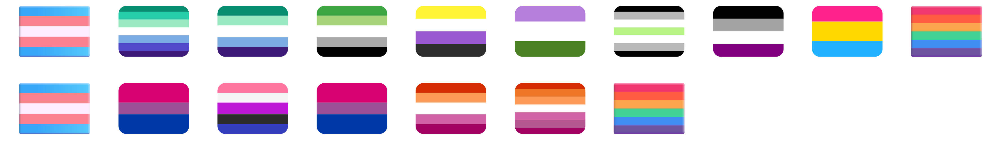
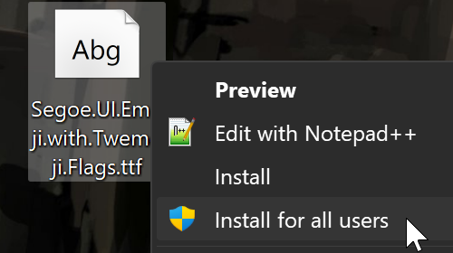
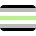

<h1 align="center">Add Pride Flag Emojis to Windows 8-11</h1>

  

    
    
    
  

<h2 align="center">This font adds <b>pride flag emojis</b> as ZWJ sequences! 🩷‍💛‍🩵 ❤️‍🧡‍🤍‍🩷‍💜 💛‍🤍‍💜‍🖤 💚‍💚‍🤍‍🩵‍💜 🩷‍💜‍💙 💚‍💚‍🤍‍🩶‍🖤</h2>

While I was working on [flag-emojis-for-windows](https://github.com/Chasmical/flag-emojis-for-windows), I saw a blog post from Unicode explaining why they've stopped taking in proposals for flags, and thought it'd be a cool idea to use heart emojis to represent pride flags.

<i>Excerpt from "The Past and Future of Flag Emoji" in Unicode Blog</i>
(<a href="https://blog.unicode.org/2022/03/the-past-and-future-of-flag-emoji.html">link</a>)

> […] [Flags] tend to change over time! In the past six years since adding a Pride Flag to the Unicode Standard (2019) it’s already been redesigned. Many times. Identities are fluid and unstoppable which makes mapping them to a formal unchanging universal character set incompatible.
>
> […] Rather than relying on Unicode to add new emoji for every concept under the Sun (this is simply not attainable) the citizens of the world have proven to be infinitely creative and fluid: often using existing emoji like the colored hearts (❤️️ 🧡 💛 💚 💙 💜 🤎 🖤 🤍) to express themselves. […]
>
> […] With this in mind, the Emoji Subcommittee has put forth a strategy to add a pink heart, a light blue heart, and a gray heart to the Unicode Standard. These are colors commonly found in gender flags (gender fluid pride flag), sexuality flags (bisexual pride flag), in sports team colors (Go Spurs!) and even some regional flags (Brussels). […]

And so I made a font that displays sequences like 💛‍🤍‍💜‍🖤 as actual flags. And it was only now, when I'm writing this README that I've realized that I wasn't the first to make a font like this, PronounsPage beat me to it by 2 months! Their [Queermoji font](https://queermoji.pronouns.page) adds a lot more ligatures than this one does, and its sequences take up a little less space, so consider using it instead.

You might want to install [flag-emojis-for-windows](https://github.com/Chasmical/flag-emojis-for-windows) in that case, if you want to see country flags on Windows.

But, if you want pride flags to be displayed system-wide (taskbar, Notepad, Word, Excel, and by default everywhere), and not just in browsers or apps that allow you to use custom fonts, then you can install this font. It's still a work-in-progress, so keep an eye on updates.

## Installation (Windows)

### [Download the font](https://github.com/Chasmical/pride-flag-emojis/releases/latest/download/Segoe.UI.Emoji.with.Pride.Flags.ttf) and install it ***for all users***! Restart your PC to apply changes.

**"Install for all users" (recommended)** will attempt to render country flags in the system and many other apps too.

Regular **"Install"** will only affect a few certain apps: Chromium-based browsers (Chrome, Opera, Vivaldi, etc), and Electron-based apps (Discord, VS Code, etc), so if that's enough for you, you can do this type of install.

## Flags table

ZWJ sequences can't be entered with emoji pickers, so copy them from here:

| Flag                   | Font ligature | Fallback hearts  | svg |
|-----------------------:|:-------------:|:----------------:|-----|
| Asexual                | 🖤‍🩶‍🤍‍💜 | 🖤🩶🤍💜 |  |
| Agender                | 🖤‍🩶‍🤍‍💚‍🤍‍🩶‍🖤 | 🖤🩶🤍💚🤍🩶🖤 |  |
| Aromantic              | 💚‍💚‍🤍‍🩶‍🖤 | 💚💚🤍🩶🖤 |  |
| Bisexual               | 🩷‍🩷‍💜‍💙‍💙 | 🩷🩷💜💙💙 |  |
| (shortcut) Bisexual    | 🩷‍💜‍💙 | 🩷💜💙 |  |
| Non-binary             | 💛‍🤍‍💜‍🖤 | 💛🤍💜🖤 |  |
| Genderfluid            | 🩷‍🤍‍💜‍🖤‍💙 | 🩷🤍💜🖤💙 |  |
| Gay man                | 💚‍💚‍💚‍🤍‍🩵‍💙‍💜 | 💚💚💚🤍🩵💙💜 |  |
| (5 stripes) Gay man    | 💚‍💚‍🤍‍🩵‍💜 | 💚💚🤍🩵💜 |  |
| Lesbian                | ❤️‍🧡‍🧡‍🤍‍🩷‍💜‍💜 | ❤️🧡🧡🤍🩷💜💜 |  |
| (5 stripes) Lesbian    | ❤️‍🧡‍🤍‍🩷‍💜 | ❤️🧡🤍🩷💜 |  |
| Pansexual              | 🩷‍💛‍🩵 | 🩷💛🩵 |  |
| Genderqueer            | 💜‍🤍‍💚 | 💜🤍💚 |  |

## To-do list

TODO: there's still a ton to assign and to do.

| Flag                   | Fallback hearts  |
|-----------------------:|:----------------:|
| 🏳️‍⚧️ Transgender         | 🩵🩷🤍🩷🩵 |

Unicode codepoints of hearts of all colors (+ZWJ):

- ❤️ `U+2764`
- 🩷 `U+1fa77`
- 🧡 `U+1f9e1`
- 💛 `U+1f49b`
- 💚 `U+1f49a`
- 💙 `U+1f499`
- 🩵 `U+1fa75`
- 💜 `U+1f49c`
- 🤎 `U+1f90e`
- 🖤 `U+1f5a4`
- 🩶 `U+1fa76`
- 🤍 `U+1f90d`
- ZWJ `U+200d`

## Twemoji-style flags

The SVG file is a 36×36 box (no units), and the flag is a centered 36×26 4-rounded box.
The stripes' heights may differ from the specs for better legibility on lower resolutions. For
example, tricolor 8:10:8 appears to preserve the stripes' heights when downscaled best. 9:8:9 makes
the center stripe look kinda thin. Perhaps it's also the rounded corners at the top and bottom that
give an illusion of the outer stripes being somehow bigger.

Best proportions I've found are 10:8:10, 6.5:6.5:6.5:6.5, 5:5:6:5:5, 3:4:4:4:4:4:3. Some references from Twemoji: 🇦🇲 🇦🇷 🇦🇹 🇧🇴 8:10:8; 🇦🇪 🇧🇬 🇬🇦 🇭🇺 9:8:9; 🇩🇪 🇪🇪 9:9:8; 🇪🇭 🇯🇴 🇰🇼 🇸🇩 8.5:9:8.5; 🇰🇲 🇲🇺 1:1:1:1; 🇵🇷 5:5:6:5:5; 🇹🇬 1:1:1:1:1; 🇿🇼 3:4:4:4:4:4:3.

